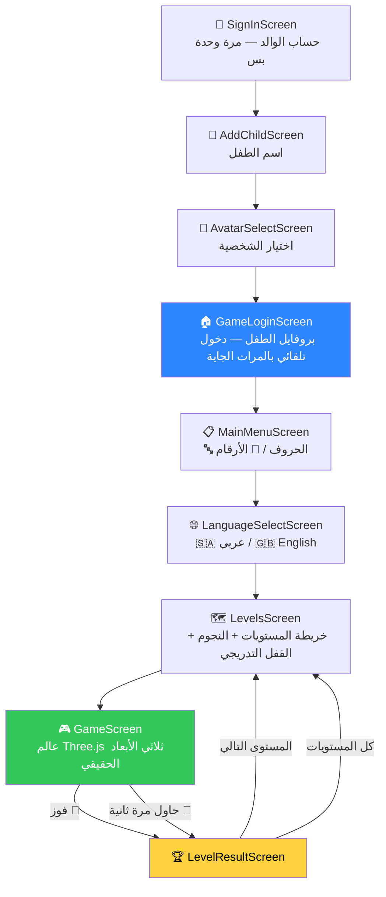

# 🧊 Hamoudi Blocks | مكعبات حمودي

> 🚧 **نسخة مبدئية لسة قيد التطوير** — أول نسخة قابلة للعب، وفيه مميزات
> جديدة تنضاف وتتحسّن أول بأول.

## نظرة عامة عن المشروع (About The Project)

أغلب الأطفال لا يفضّلون الدراسة — يفضّلون اللعب. فمهما كانت بطاقات
التعليم التقليدية ملوّنة أو فيها رسوم متحركة، تبقى بالنسبة للطفل "دراسة"
يُطلب منه إنجازها، لا شي يختاره بمحض إرادته. فليش ما يكون التعليم نفسه
على شكل لعبة حقيقية، يدخلها الطفل لأنه يبي يلعب، ويتعلّم الحروف
والأرقام بدون ما يحس إنه "يذاكر" أصلاً؟

هذا هو "مكعبات حمودي" — عالم ثلاثي الأبعاد حقيقي يقدر الطفل يمشي فيه
بحرية عبر جويستيك لمسي، يدور حول منصّات موزّعة عشوائياً، كل منصّة عليها
حرف أو رقم أو كلمة. يلقى الصحيح فتحتفل شخصيته (كونفيتي + قفزة)، يلقى
الغلط فيسمع صوتاً ودوداً يشجّعه يحاول مرة ثانية بدون أي "خسارة نهائية".
كل الأصوات مسجّلة بصوت عربي طبيعي (مو آلي)، والحرف يتكرر 3 مرات عند
النجاح عشان يترسّخ بذاكرة الطفل. النتيجة: لعبة يريد الطفل يلعبها،
والتعلّم يصير أثر جانبي للعب نفسه، لا هدف مفروض عليه.

المشروع يشتغل بتكلفة مالية صفر ومستمرة — بدون إعلانات، بدون مشتريات
داخل التطبيق، وبدون أي اشتراك: تطبيق Flutter محلي، عالم ثلاثي الأبعاد
حقيقي بـ Three.js، صوت طبيعي مولَّد مرة وحدة عبر الطبقة المجانية من
Azure، وخط إنتاج مجاني عبر GitHub Actions يبني نسخة آيفون قابلة
للتثبيت بدون امتلاك جهاز ماك. مصمَّم للتثبيت المباشر على الجوال —
بدون الحاجة لأي متجر تطبيقات.

## ✨ المميزات الحالية (Features)

- 74 عنصر تعليمي: 28 حرف عربي، 26 حرف إنجليزي، 10 أرقام عربية، 10
  أرقام إنجليزية — كل مستوى 4 عناصر.
- عالم ثلاثي الأبعاد حقيقي: شخصية بلوكية، جويستيك لمسي حر الحركة، قفز،
  4 منصّات موزَّعة عشوائياً حول اللاعب كل جولة.
- نظام 3 قلوب لكل مستوى، بدون "Game Over" نهائي — الخطأ يعيد نفس
  السؤال بقلوب جديدة بس.
- تلميحات اتجاه (أيقونة سهم صغيرة + صوت) بعد 15 ثانية بحث بدون تقدّم.
- حركات احتفال (كونفيتي، قفزة)، حركات خمول، وتفاعلات مرحة عند لمس
  الشخصية مباشرة.
- صوت عربي فصيح طبيعي مسجَّل مسبقاً (Azure Neural TTS) — كل عنصر
  صحيح يتكرر 3 مرات عند النجاح لترسيخه بالذاكرة.
- خريطة مستويات متعرّجة (رود ماب) بنجوم وفتح تدريجي للمستويات.
- 6 شخصيات بلوكية قابلة للاختيار بمعاينة 3D حية متحركة.
- يشتغل بدون إنترنت بالكامل بعد التثبيت؛ بدون أي تكلفة مستمرة.
- قابل للتثبيت المباشر على أندرويد وآيفون — بدون متجر تطبيقات.

## 🎯 نقاط ضعف الطفل (Weak Points Tracking)

ميزة مخصَّصة للوالدين (يوصلها زر بشاشة دخول اللعبة، لا يشوفها الطفل):

1. الوالدين يختارون القسم (حروف/أرقام × عربي/إنجليزي)، وبعدها يحدّدون
   من شبكة العناصر أي حرف أو رقم يحتاج الطفل تدريب إضافي عليه.
2. أي عنصر مُحدَّد ينضاف تلقائياً كجولة إضافية بآخر كل مستوى قادم بنفس
   القسم — يعني الطفل يمرّ عليه أكثر من مرة طبيعياً أثناء اللعب العادي،
   بدون أي شاشة "تدريب" منفصلة يحس فيها إنه يُعاقَب أو يُختبَر.
3. الوالدين يقدرون يشيلون العلامة أي وقت لو صار الطفل متقناً للعنصر،
   فيرجع المستوى لعدده الطبيعي من العناصر.
4. فيه خيار مستقل لإعادة تعيين تقدّم قسم كامل (تُقفَل كل مستوياته من
   جديد) بدون ما يمسح نقاط الضعف المحدَّدة — الميزتان مستقلتان عن بعض.

من الناحية التقنية: العلامات تُخزَّن بـ `ChildProfile.weakItemKeys`
(مفتاح بصيغة `group_symbol`)، و`GameScreen._buildRoundItems()` هو اللي
يدمج عناصر المستوى العادية مع الجولات الإضافية وقت بناء إعدادات كل
جولة — راجعي [`lib/screens/settings/weak_points_screen.dart`](lib/screens/settings/weak_points_screen.dart).

## 🛠️ الأدوات المستخدمة (Technologies)

- **Flutter / Dart** — the app shell, state management via `provider`,
  local storage via `shared_preferences`.
- **Three.js** — the 3D game world, running inside a local WebView
  (`webview_flutter`), fully offline.
- **Azure Cognitive Services (Neural TTS)** — one-time generation of
  natural voice audio, played back as pre-recorded clips (not live TTS).
- **GitHub Actions** — a free macOS cloud runner that builds an unsigned
  iOS IPA without owning a Mac.
- **Sideloadly** — installs the unsigned IPA on a real iPhone using a free
  Apple ID, no paid developer account.

## خريطة الشاشات (Screen Flow)



## هيكل الملفات (Project Structure)

```
lib/
  app.dart                  # MaterialApp + AuthGate (يحدد أول شاشة حسب حالة الجلسة)
  theme/app_theme.dart      # الألوان + NeoBox (حدود سوداء + ظل صندوقي)
  models/                   # ChildProfile, AvatarOption, ContentItem/Group
  data/content_repository.dart  # كل الحروف/الأرقام (74 عنصر) + تقسيمها لمستويات
  services/
    auth_service.dart       # بوابة حساب الوالد (محلي الآن، Firebase لاحقاً)
    profile_service.dart    # بروفايلات الأطفال + التقدم (محلي الآن)
    audio_service.dart      # يشغّل مقاطع assets/audio/ الحقيقية (Azure Neural TTS)
  screens/
    onboarding/  home/  game/  settings/
    game/game_screen.dart   # WebView محلي لعالم Three.js + جسر GameChannel
  widgets/
    big_button.dart  star_row.dart (StarRow + HeartRow)  blocky_avatar.dart

assets/game3d/               # عالم اللعب ثلاثي الأبعاد (Three.js، بدون إنترنت)
  index.html  style.css  game.js
  vendor/three.min.js        # مكتبة Three.js مُضمَّنة محلياً (لا CDN؛ سكربت
                              # عادي مو ES Module — راجعي التعليق أعلى game.js)
  fonts/*.woff2               # خط Baloo Bhaijaan 2 مُضمَّن محلياً

assets/audio/                 # صوت عربي طبيعي مسجَّل مسبقاً (Azure Neural TTS، فصحى)
  content/{ar|en}_{letter|number}_N.wav       # "قُل: أ... مثل أسد!" (74 ملف)
  content_found/{ar|en}_{letter|number}_N.wav # تكرار 3 مرات عند النجاح (74 ملف)
  phrases/*.wav                                 # ترحيب/تشجيع/تلميح/خطأ/فوز (12 ملف)
```

كل خدمة (`AuthService`, `ProfileService`, `AudioService`) مصمَّمة بحيث
الشاشات تتعامل مع واجهتها العامة فقط — استبدال الجسم الداخلي لاحقاً
(Firebase، خدمة صوت مختلفة) ما يحتاج تعديل أي شاشة.

## أوامر التشغيل والاختبار (Getting Started)

```bash
flutter pub get
flutter run          # يشغّله على أي جهاز/محاكي متصل
flutter test         # اختبار الدخان
flutter analyze      # فحص ثابت — يفترض يطلع "No issues found!"
```

## طريقة البناء والتثبيت المباشر (Build & Deploy)

```bash
# أندرويد — يعطيك APK تنقلينه للجوال وتثبتينه مباشرة
flutter build apk --release

# آيفون — يحتاج ماك + Xcode + كيبل + Apple ID عادي (مجاني)
flutter build ios --release
# بعدها افتحي ios/Runner.xcworkspace بـ Xcode ونفّذي Run على الجهاز الموصول.
```

بدون ماك؟ راجعي [NEXT_STEPS.md](NEXT_STEPS.md) لطريقة بناء نسخة آيفون
عبر GitHub Actions (ماك سحابي مجاني) وتثبيتها بـ Sideloadly.

## توثيق جسر التواصل (JavaScript Bridge)

`GameScreen` (بـ `lib/screens/game/game_screen.dart`) يعرض
`assets/game3d/index.html` عبر `webview_flutter` محلياً وبدون إنترنت.
التواصل بالاتجاهين عبر JavaScript Channel واحد اسمه `GameChannel`:

| الاتجاه | الرسالة | متى تُرسَل | ملاحظات |
|---|---|---|---|
| الصفحة → Flutter | `{type:'ready'}` | عند تهيئة الصفحة | يستقبلها `_sendInitConfig()` ويرد بـ `init` |
| الصفحة → Flutter | `{type:'audio', event, symbol?, direction?}` | كل حدث صوتي | تُموَّل لميثود مطابق بـ `AudioService` |
| الصفحة → Flutter | `{type:'result', outcome:'win'\|'retry', heartsRemaining?, roundIndex?}` | انتهاء المستوى | فوز → `LevelResultScreen(didWin:true)`، خسارة → استئناف نفس الجولة |
| الصفحة → Flutter | `{type:'exit'}` | ضغط ✖️ | يرجع للشاشة السابقة |
| Flutter → الصفحة | `window.HamoudiGame.init(config)` | بعد استقبال `ready` | يحمل اسم الطفل، ألوان `AvatarOption` المختار، وعناصر المستوى من `ContentRepository` |

راجعي التعليقات أعلى `assets/game3d/game.js` لتفاصيل كل رسالة ولمنطق
اللعب الكامل (القلوب، التلميح، الاحتفال، الحركات).

## خطة التطوير (Roadmap)

- ✅ **Milestone 1** — هيكل تطبيق Flutter (حساب والدين، بروفايل طفل،
  نظام نجوم وقفل تدريجي، هوية بصرية).
- ✅ **Milestone 2** — عالم اللعب ثلاثي الأبعاد الحقيقي (Three.js داخل
  WebView محلي، جسر `GameChannel` كامل).
- ✅ **Milestone 3** — الصوت الطبيعي المسجَّل مسبقاً (Azure Neural TTS،
  فصحى، 160 مقطع صوتي).
- 4️⃣ **Milestone 4 (قادمة)** — Firebase: حساب والدين حقيقي + مزامنة
  تقدّم الطفل بالسحابة + إشعارات تذكير خفيفة، فوق نفس طبقة الخدمات
  الحالية بدون تعديل الشاشات.
- 5️⃣ **Milestone 5 (قادمة)** — التوزيع النهائي المباشر على جهاز حمودي
  وتصميم أيقونة أصلية نهائية.

تفاصيل كل مرحلة (القرارات، البدائل المجرَّبة، الأسباب) موثّقة بـ
[NEXT_STEPS.md](NEXT_STEPS.md).
