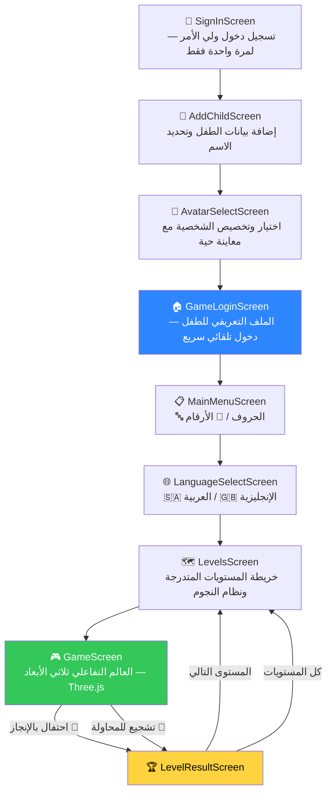

# 🧊 مكعبات حمودي | Hamoudi Blocks

> 🚧 **إصدار أولي قيد التطوير** — النسخة الأولى القابلة للتشغيل، ويجري العمل على إضافة المزايا والتحسينات باستمرار.

---

## 📖 نظرة عامة عن المشروع (About The Project)

يميل معظم الأطفال بطبيعتهم إلى اللعب وينفرون من أساليب الدراسة التقليدية؛ فمهما كانت بطاقات التعليم المعتادة ملوّنة أو مدعمة بالرسوم، تظل في نظر الطفل "مهمة دراسية" تُفرض عليه بدلاً من نشاط يختاره برغبته. من هذا المنطلق، يسعى هذا المشروع إلى تحويل العملية التعليمية إلى لعبة حقيقية وممتعة يخوضها الطفل بدافع الفضول والترفيه، ليتعلم الحروف والأرقام بصورة سلسة وتلقائية كأثر إيجابي للعب دون الشعور بعبء التلقين.

يُعد **"مكعبات حمودي"** عالماً تفاعلياً ثلاثي الأبعاد يتيح للطفل التجول بحرية تامة باستخدام عصا تحكم لمسية (Joystick)، واستكشاف منصات موزعة بصورة عشوائية تعرض كل منها حرفاً، أو رقماً، أو كلمة. عند اختيار المنصة الصحيحة، تبتهج شخصية الطفل بحركات احتفالية ومؤثرات بصرية (تناثر القصاصات والقفز)، وفي حال الخطأ، يوجهه صوت ودود يشجعه على إعادة المحاولة دون أي شعور بالإحباط أو الخسارة النهائية. جرى تسجيل كافة المقاطع الصوتية بصوت بشري طبيعي عالي الجودة باللغة العربية الفصحى، مع تكرار نطق العنصر 3 مرات متتالية عند الإجابة الصحيحة لترسيخه في الذاكرة.

يعمل المشروع دون أي تكاليف تشغيلية مستمرة؛ إذ يخلو تماماً من الإعلانات والمشتريات والاشتراكات. ويعتمد على معمارية محلية خفيفة تجمع بين إطار عمل Flutter للعرض العام، وبيئة ثلاثية الأبعاد تفاعلية مبنية بواسطة Three.js، وملفات صوتية طبيعية أُنشئت عبر الخدمة السحابية المجانية من Azure، إضافة إلى خط بناء مؤتمت ومجاني عبر GitHub Actions لإنتاج نسخ صالحة للتثبيت على نظام iOS دون الحاجة لامتلاك حاسوب Mac. كما صُمم التطبيق ليُثبّت مباشرة على الهواتف دون اشتراط وجوده في المتاجر الرقمية.

---

## ✨ المميزات الحالية (Features)

* **74 عنصراً تعليمياً:** يشمل 28 حرفاً عربياً، و26 حرفاً إنجليزياً، و10 أرقام عربية، و10 أرقام إنجليزية (موزعة بواقع 4 عناصر في كل مستوى).
* **عالم ثلاثي الأبعاد حقيقي:** شخصيات بتصميم المكعبات المميز، وتحكم سلس عبر عصا لمسية حرة، وإمكانية القفز، مع توزيع عشوائي لأربع منصات حول اللاعب في كل جولة.
* **نظام قلوب مرن ومشجع:** 3 محاولات (قلوب) لكل مستوى دون شاشة خسارة نهائية محبطة؛ حيث يتيح الخطأ إعادة المحاولة على السؤال ذاته بفرص متجددة.
* **تذكير دوري ذكي:** كل 15 ثانية بحث بدون تقدّم، يتبادل التطبيق بين تكرار نطق الحرف/الرقم صوتياً فقط (تعزيز للحفظ)، وتلميح اتجاه بصري (سهم صغير غير معيق للرؤية) مع صوت مصاحب.
* **تفاعلات وحركات مرحة:** حركات احتفالية متنوعة (قفز وابتهاج)، حركات خمول أثناء التوقف، واستجابة حركية فورية عند لمس الشخصية مباشرة.
* **صوت طبيعي باللغة العربية الفصحى:** تسجيلات صوتية واضحة ومسجلة مسبقاً، مع تكرار نطق العنصر الصحيح 3 مرات لتعزيز الحفظ والاستيعاب.
* **خريطة مستويات متدرجة (Roadmap):** نظام تقييم بالنجوم يتيح فتح المراحل الجديدة تدريجياً بحسب إنجاز الطفل.
* **نقاط ضعف الطفل:** أداة مخصصة لأولياء الأمور لتحديد حروف/أرقام بعينها يحتاج الطفل تدريباً إضافياً عليها يدوياً — راجعي القسم المخصص لها أدناه.
* **6 شخصيات متنوعة:** إمكانية الاختيار والتخصيص مع معاينة تفاعلية حية ومتحركة للشخصية ثلاثية الأبعاد.
* **تشغيل محلي كامل (Offline-First):** استقلالية تامة عن الاتصال بالإنترنت بعد التثبيت، مع دعم التثبيت المباشر على نظامي Android وiOS.

---

## 🎯 نقاط ضعف الطفل (Weak Points Tracking)

ميزة موجّهة للوالدين، يوصلها زر مكتوب عليه "(للوالدين)" بشاشة دخول اللعبة نفسها — بدون بوابة حماية فعلية حالياً (لا رمز ولا سؤال تأكيد)، فأي حد يفتح التطبيق يقدر يضغط عليه، حتى الطفل نفسه لو استكشف الأزرار.

1. الوالدان يختاران القسم (حروف/أرقام × عربي/إنجليزي)، ثم يحدّدان يدوياً من شبكة العناصر أي حرف أو رقم يحتاج الطفل تدريباً إضافياً عليه — التطبيق **لا يحلّل** أداء الطفل تلقائياً، التحديد بالكامل بيد الوالدين.
2. أي عنصر مُحدَّد ينضاف تلقائياً كجولة إضافية بآخر كل مستوى قادم بنفس القسم — يمرّ عليه الطفل أكثر من مرة طبيعياً أثناء اللعب العادي، بدون أي شاشة "تدريب" منفصلة يحس فيها إنه يُعاقَب أو يُختبَر.
3. يقدر الوالدان يشيلان العلامة أي وقت لو صار الطفل متقناً للعنصر، فيرجع المستوى لعدده الطبيعي من العناصر.
4. فيه خيار مستقل لإعادة تعيين تقدّم قسم كامل (تُقفَل كل مستوياته من جديد) بدون ما يمسح نقاط الضعف المحدَّدة — الميزتان مستقلتان عن بعض.

من الناحية التقنية: العلامات تُخزَّن بـ `ChildProfile.weakItemKeys` (مفتاح بصيغة `group_symbol`)، و`GameScreen._buildRoundItems()` هو اللي يدمج عناصر المستوى العادية مع الجولات الإضافية وقت بناء إعدادات كل جولة — راجعي [`lib/screens/settings/weak_points_screen.dart`](lib/screens/settings/weak_points_screen.dart).

---

## 🛠️ التقنيات المستخدمة (Technologies)

* **Flutter & Dart:** بناء واجهات المستخدم وإدارة الحالة ومنطق التنقل وربط الخدمات.
* **Three.js & WebGL:** تشغيل بيئة اللعبة التفاعلية ثلاثية الأبعاد والتصادمات داخل WebView محلي.
* **Azure Neural TTS:** توليد الملفات الصوتية بنبرة عربية فصحى طبيعية عالية الدقة.
* **GitHub Actions:** أتمتة البناء والتكامل المستمر (CI/CD) لإنتاج حزم التطبيق دون الحاجة لعتاد مخصص.
* **Sideloadly:** التثبيت المباشر لحزمة iOS غير الموقّعة على أجهزة المستخدمين بحساب Apple ID مجاني.

---

## 🗺️ خريطة الشاشات (Screen Flow)



---

## 🏗️ هيكل الملفات والمجلدات (Project Structure)

```text
.
├── lib/
│   ├── app.dart                   # التهيئة الشاملة للتطبيق وبوابة إدارة الجلسة (AuthGate)
│   ├── theme/
│   │   └── app_theme.dart         # لوحة الألوان وسمات NeoBox البصرية (حدود بارزة وظلال حادة)
│   ├── models/                    # نماذج البيانات (ChildProfile, AvatarOption, ContentItem/Group)
│   ├── data/
│   │   └── content_repository.dart# مستودع المحتوى (تخزين الـ 74 عنصراً وتوزيعها على المستويات)
│   ├── services/
│   │   ├── auth_service.dart      # واجهة تسجيل دخول ولي الأمر (تخزين محلي قابل للربط لاحقاً)
│   │   ├── profile_service.dart   # حفظ بيانات الطفل وتتبع تقدمه ونقاط ضعفه
│   │   └── audio_service.dart     # تشغيل المقاطع الصوتية التعليمية والمؤثرات التفاعلية
│   ├── screens/
│   │   ├── onboarding/            # شاشات التسجيل الأولي وتجهيز الحساب
│   │   ├── home/                  # القوائم الرئيسية واختيار اللغات وتتبع المراحل
│   │   ├── game/
│   │   │   └── game_screen.dart   # الحاضنة لشاشة WebView وجسر التواصل مع اللعبة
│   │   └── settings/              # إعدادات الصوت ونقاط ضعف الطفل (خاصة بالوالدين)
│   └── widgets/                   # العناصر المشتركة (BigButton, StarRow/HeartRow, BlockyAvatar)
├── assets/
│   ├── game3d/                    # بيئة العالم ثلاثي الأبعاد (تعمل محلياً دون الحاجة لاتصال خارجي)
│   │   ├── index.html             # صفحة العرض المدمجة
│   │   ├── game.js                # محرك اللعبة، التحكم بالحركة، المنصات، واكتشاف التصادم
│   │   ├── style.css              # الأنماط والتنسيقات البصرية للمشهد
│   │   ├── vendor/
│   │   │   └── three.min.js       # حزمة مكتبة Three.js مدمجة كلياً دون CDN
│   │   └── fonts/                 # ملفات الخطوط المدمجة محلياً (Baloo Bhaijaan 2)
│   └── audio/                     # مكتبة التسجيلات والمؤثرات الصوتية الطبيعية
│       ├── content/               # نطق الحروف والكلمات التعليمية ("قل: ألف... مثل أسد!")
│       ├── content_found/         # ملفات التكرار الثلاثي عند الإجابة الصحيحة
│       └── phrases/               # عبارات التشجيع والترحيب والتوجيه الصوتي
└── README.md
```

---

## 🚀 أوامر التشغيل والاختبار (Getting Started)

```bash
# تثبيت كافة الحزم والتبعيات البرمجية للمشروع
flutter pub get

# إجراء الفحص الساكن للكود للتأكد من سلامته وخلوه من المشكلات
flutter analyze

# تشغيل اختبارات السلامة والتحقق البرمجي
flutter test

# تشغيل المشروع على الجهاز المتصل أو المحاكي
flutter run
```

---

## 📦 بناء الحزم والتثبيت المباشر (Build & Deploy)

### 🤖 نظام أندرويد (Android)

```bash
# إنشاء حزمة تثبيت مستقلة بصيغة APK
flutter build apk --release
```

*يتم إنتاج الملف داخل المسار `build/app/outputs/flutter-apk/app-release.apk` ويمكن نقله وتثبيته مباشرة على الجهاز.*

### 🍏 نظام آي أو إس (iOS)

```bash
# بناء حزمة نظام iOS
flutter build ios --release
```

*افتح مسار `ios/Runner.xcworkspace` عبر بيئة Xcode وثبّت التطبيق مباشرة على الهاتف المتصل باستخدام حساب Apple ID شخصي ومجاني.*

بدون ماك؟ راجعي [NEXT_STEPS.md](NEXT_STEPS.md) لطريقة بناء نسخة iOS عبر GitHub Actions (ماك سحابي مجاني) وتثبيتها بـ Sideloadly.

---

## 🌉 توثيق جسر التواصل (JavaScript Bridge)

يُنظّم تبادل البيانات بين واجهة التطبيق (Flutter) ومحرك المشهد ثلاثي الأبعاد (Three.js) عبر قناة موحدة باسم `GameChannel`:

| الاتجاه | الرسالة / الحدث | توقيت الإرسال | ملاحظات |
| --- | --- | --- | --- |
| **Three.js ➔ Flutter** | `{ type: 'ready' }` | فور اكتمال تحميل المشهد ثلاثي الأبعاد وجاهزيته. | إشعار للبدء في تزويد اللعبة ببيانات الطفل والمرحلة. |
| **Three.js ➔ Flutter** | `{ type: 'audio', event: ... }` | عند الحاجة لتشغيل مؤثر صوتي أو جملة تعليمية. | يُحوّل الطلب إلى `AudioService` لتشغيل المقطع الصوتي المحلي المناسب. |
| **Three.js ➔ Flutter** | `{ type: 'result', outcome: 'win'\|'retry', ... }` | عند إكمال كافة المنصات بنجاح أو نفاد فرص المحاولة. | يُحدّث سجل الطفل وتُحسب النجوم المكتسبة ثم يُوجّه إلى شاشة النتائج. |
| **Three.js ➔ Flutter** | `{ type: 'exit' }` | عند الضغط على زر الإغلاق والرجوع (✖️). | إغلاق شاشة اللعبة الحالية والعودة إلى خريطة المستويات. |
| **Flutter ➔ Three.js** | `window.HamoudiGame.init(config)` | مباشرة بعد استقبال إشعار الجاهزية `{ type: 'ready' }`. | تمرير اسم الطفل، وألوان شخصيته، وعناصر المرحلة المستخرجة من `ContentRepository`. |

---

## 🗺️ خطة التطوير (Roadmap)

* [x] **المرحلة الأولى (Milestone 1):** تأسيس الهيكل العام للتطبيق، الشاشات الأساسية، وبناء السمة البصرية الموحدة.
* [x] **المرحلة الثانية (Milestone 2):** بناء العالم التفاعلي ثلاثي الأبعاد عبر Three.js وضبط حركة الشخصية والمنصات داخل WebView محلي.
* [x] **المرحلة الثالثة (Milestone 3):** توليد وتضمين الحزم الصوتية باللغة العربية الفصحى عبر Azure Neural TTS وبرمجة آليات التكرار الصوتي.
* [ ] **المرحلة الرابعة (Milestone 4 - قادمة):** ربط حساب حقيقي ومزامنة تقدّم الطفل سحابياً عبر Firebase (Auth + Cloud Firestore)، مع إشعارات تذكير خفيفة للوالدين.
* [ ] **المرحلة الخامسة (Milestone 5 - قادمة):** التوزيع المباشر النهائي على جهاز حمودي (أندرويد وآيفون)، وتصميم أيقونة أصلية نهائية للتطبيق.
* [ ] **المرحلة السادسة (Milestone 6 - فكرة مستقبلية):** شخصية "صديق" داخل عالم اللعب تتفاعل مع الطفل بعبارات تشجيع وتعليقات مسجَّلة مسبقاً (بنفس آلية الصوت الحالية — ملفات جاهزة، بدون أي تكلفة إضافية). **مو محادثة ذكاء اصطناعي مفتوحة** — الأمان أولوية مع طفل بهالعمر (ردود ذكاء اصطناعي حي غير متوقّعة وغير قابلة للمراجعة مسبقاً)، والتكلفة المستمرة لكل رسالة تتعارض مع مبدأ "صفر تكلفة" للمشروع.
* [ ] **المرحلة السابعة (Milestone 7 - فكرة مستقبلية):** لعب متعدد اللاعبين — يقدر حمودي يدخل نفس العالم مع أصدقائه الحقيقيين اللي بعمره (رياض أطفال/تمهيدي). التواصل بينهم عبر **عبارات وإيموجيهات جاهزة مسبقاً فقط** (زي "أحسنت! 👏"، "هيا نلعب! 🎮") — **بدون كتابة حرة إطلاقاً**، عشان الأمان مع أطفال بهالعمر. تقنياً يحتاج مزامنة لحظية خفيفة (Firebase Realtime Database ضمن الطبقة المجانية)، تُبنى فوق نفس معمارية Milestone 4.
* [ ] **المرحلة الثامنة (Milestone 8 - فكرة مستقبلية):** توسيع المحتوى التعليمي لأقسام جديدة غير الحروف والأرقام — زي الأشكال، الألوان، العدّ والجمع البسيط، أو الحيوانات — بنفس بنية `ContentRepository` الحالية (تُضاف كمجموعة جديدة بدون تعديل أي شاشة).

تفاصيل كل مرحلة (القرارات، البدائل المجرَّبة، الأسباب) موثّقة بـ [NEXT_STEPS.md](NEXT_STEPS.md).
